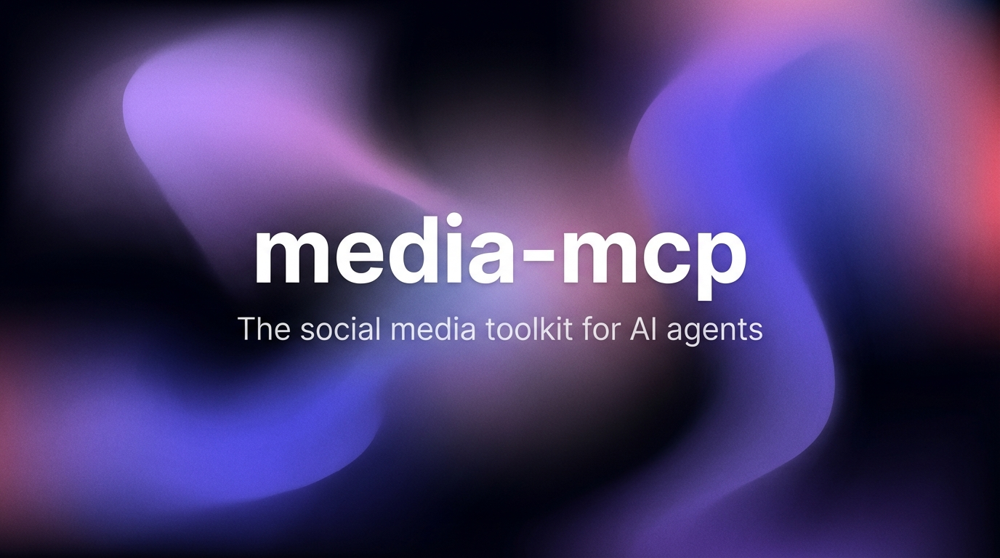

<p align="center">
  
</p>

# media-mcp

Social media at your fingertips. 30 tools across Twitter/X, YouTube, Instagram, and video processing — from Claude Desktop, Claude Code, or any MCP client. 100% open source.

Point it at a tweet and get the full text, metrics, and video transcription. Give it a YouTube URL and get the transcript. Drop an Instagram reel and get the media downloaded plus audio transcribed. All transcription runs locally via Whisper — no audio leaves your machine.

## What it does

- **Fetches** tweets, threads, profiles, followers, trends, and search results from Twitter/X (26 tools via TwitterAPI.io REST API)
- **Transcribes** video audio locally using whisper-cli — downloads media, extracts audio with ffmpeg, runs Whisper on your hardware
- **Downloads** Instagram posts, reels, and carousels to local folders via a self-hosted Cobalt instance
- **Extracts** frames from any video URL (YouTube, Twitter, TikTok, Instagram, direct MP4) at configurable FPS with optional time ranges
- **Monitors** Twitter users in real-time and filters tweets by keyword rules

## How it works

The LLM never scrapes HTML or parses DOM. Every tool calls a purpose-built API and returns structured, LLM-ready text.

**For text data** (tweets, profiles, trends): one REST call to TwitterAPI.io, parsed into formatted output.

**For transcription** (tweet videos, YouTube, Instagram reels): the pipeline downloads media to a temp file, extracts audio with ffmpeg (16kHz mono WAV), transcribes with whisper-cli, then cleans up. For YouTube, captions are tried first (instant) — Whisper is only the fallback.

**For visual data** (Instagram images, video frames): media is downloaded to a local folder and absolute file paths are returned so the LLM can read them directly with vision.

## Pipeline

```
URL ──► Detect platform
             │
             ├── Twitter ──► TwitterAPI.io REST ──► structured text
             │                     │
             │               has video? ──► download ──► ffmpeg ──► whisper-cli
             │
             ├── YouTube ──► try captions (instant)
             │                     │
             │               no captions? ──► yt-dlp ──► ffmpeg ──► whisper-cli
             │
             ├── Instagram ──► Cobalt API ──► download media to folder
             │                     │
             │               has video? ──► ffmpeg ──► whisper-cli
             │
             └── Video URL ──► download ──► ffmpeg -vf fps=N ──► frame JPGs
```

All transcription is local. All temp files are cleaned up. The LLM gets structured text or file paths — never raw API JSON.

## Design principles

1. **Structured data, not scraping.** Every tool calls a purpose-built API. No HTML parsing, no fragile selectors, no browser automation.
2. **Local transcription only.** Audio never leaves the machine. Whisper runs on local hardware.
3. **Captions first, Whisper second.** Don't burn compute when the platform already did the work.
4. **One tool, one job.** No multi-purpose tools with mode flags. Each tool does exactly one thing.
5. **File paths for visual content.** Return absolute paths so the LLM can see images directly.

See [`SKILL.md`](./SKILL.md) for the full pipeline details, tool reference, and anti-patterns.

## Get started

```bash
git clone https://github.com/woosal1337/media-mcp.git
cd media-mcp
npm install && npm run build
```

Download the Whisper model:

```bash
mkdir -p models
curl -L -o models/ggml-base.bin \
  https://huggingface.co/ggerganov/whisper.cpp/resolve/main/ggml-base.bin
```

Create `.env`:

```bash
cp .env.example .env
# Edit with your keys:
# TWITTER_API_KEY=your_twitterapi_io_key
# WHISPER_MODEL_PATH=/absolute/path/to/models/ggml-base.bin
# COBALT_API_URL=http://localhost:9000       (optional, for Instagram)
# COBALT_API_KEY=your_cobalt_key             (optional)
# CLOUDFLARE_ACCOUNT_ID=your_account_id     (optional, for fetch_markdown)
# CLOUDFLARE_API_TOKEN=your_api_token       (optional, for fetch_markdown)
```

## Prerequisites

| Dependency | Required | What it does | Install |
|---|---|---|---|
| [Node.js](https://nodejs.org/) 20+ | Yes | Runs the MCP server | `brew install node` |
| [ffmpeg](https://ffmpeg.org/) | Yes | Audio extraction + frame extraction | `brew install ffmpeg` |
| [whisper-cli](https://github.com/ggerganov/whisper.cpp) | Yes | Local audio transcription | `brew install whisper-cpp` |
| [yt-dlp](https://github.com/yt-dlp/yt-dlp) | Yes | Video downloads from YouTube + others | `brew install yt-dlp` |
| [TwitterAPI.io](https://twitterapi.io/) key | Yes | Powers all Twitter/X tools | [twitterapi.io](https://twitterapi.io/) |
| [Cobalt](https://github.com/imputnet/cobalt) instance | Optional | Instagram downloads | See [Cobalt setup](#cobalt-setup) |

## Configuration

### Claude Code

Add to `~/.claude/settings.json`:

```json
{
  "mcpServers": {
    "media-mcp": {
      "command": "node",
      "args": ["/absolute/path/to/media-mcp/dist/index.js"],
      "env": {
        "TWITTER_API_KEY": "your_key",
        "WHISPER_MODEL_PATH": "/absolute/path/to/media-mcp/models/ggml-base.bin",
        "COBALT_API_URL": "http://localhost:9000",
        "COBALT_API_KEY": "your_cobalt_key",
        "CLOUDFLARE_ACCOUNT_ID": "your_account_id",
        "CLOUDFLARE_API_TOKEN": "your_api_token"
      }
    }
  }
}
```

### Claude Desktop

Add to `~/Library/Application Support/Claude/claude_desktop_config.json` (macOS) or `%APPDATA%\Claude\claude_desktop_config.json` (Windows) — same structure as above.

### Environment variables

| Variable | Required | Description |
|---|---|---|
| `TWITTER_API_KEY` | Yes | API key from [twitterapi.io](https://twitterapi.io/) |
| `WHISPER_MODEL_PATH` | No | Path to Whisper model (defaults to `./models/ggml-base.bin`) |
| `COBALT_API_URL` | No | URL of your Cobalt instance (required for Instagram) |
| `COBALT_API_KEY` | No | Cobalt API key if auth is enabled |
| `CLOUDFLARE_ACCOUNT_ID` | No | Cloudflare account ID (required for `fetch_markdown`) |
| `CLOUDFLARE_API_TOKEN` | No | Cloudflare API token with Browser Rendering permission (required for `fetch_markdown`) |

## Tools

### Twitter/X — 26 tools

#### Fetching tweets

| Tool | Action | What it does |
|---|---|---|
| `get_tweet` | **Fetch + Transcribe** | Fetches tweet by URL with text, author, metrics, media, threads, articles. Transcribes video audio via Whisper. |
| `get_user_tweets` | **Fetch** | Recent tweets from a user (paginated, 20/page) |
| `search_tweets` | **Search** | Advanced search with operators (`from:`, `to:`, `#hashtag`, `min_faves:`, date ranges) |
| `get_tweet_replies` | **Fetch** | Replies to a tweet (paginated, 20/page) |
| `get_tweet_replies_v2` | **Fetch + Sort** | Replies with sorting: Relevance, Latest, or Likes |
| `get_tweet_quotes` | **Fetch** | Quote tweets of a tweet (paginated, 20/page) |
| `get_tweet_retweeters` | **Fetch** | Users who retweeted a tweet (paginated, 100/page) |
| `get_list_timeline` | **Fetch** | Tweets from a Twitter list |
| `get_community_tweets` | **Fetch** | Tweets from a Twitter community |
| `get_trends` | **Fetch** | Trending topics (worldwide or by WOEID location) |

#### Fetching profiles

| Tool | Action | What it does |
|---|---|---|
| `get_user_profile` | **Fetch** | User bio, follower counts, verification, location, website |
| `get_user_about` | **Fetch** | Extended profile info beyond the basic profile |
| `get_user_followers` | **Fetch** | Followers of a user (paginated, 200/page) |
| `get_user_following` | **Fetch** | Accounts a user follows (paginated, 200/page) |
| `get_user_mentions` | **Fetch** | Tweets mentioning a user (paginated, 20/page) |
| `get_verified_followers` | **Fetch** | Verified (blue check) followers (paginated, 20/page) |
| `search_users` | **Search** | Search users by keyword |
| `check_follow_relationship` | **Check** | Whether user A follows user B and vice versa |
| `get_space_detail` | **Fetch** | Twitter Space metadata (title, host, speakers, state) |

#### Real-time monitoring

| Tool | Action | What it does |
|---|---|---|
| `monitor_user_add` | **Start** | Begin real-time monitoring of a user's tweets |
| `monitor_user_list` | **List** | All currently monitored users |
| `monitor_user_remove` | **Stop** | Stop monitoring a user |
| `filter_rule_add` | **Create** | Add a keyword filter rule for monitoring |
| `filter_rule_list` | **List** | All active filter rules |
| `filter_rule_delete` | **Delete** | Remove a filter rule |

### YouTube — 1 tool

| Tool | Action | What it does |
|---|---|---|
| `get_youtube_transcript` | **Fetch + Transcribe** | Gets video transcript. Tries captions first (instant). Falls back to yt-dlp + ffmpeg + Whisper if no captions. |

### Instagram — 1 tool

| Tool | Action | What it does |
|---|---|---|
| `get_instagram_post` | **Download + Transcribe** | Downloads all media (images, videos, carousels) to local folder via Cobalt. Transcribes video audio with Whisper. Returns local file paths. |

### Cloudflare — 1 tool

| Tool | Action | What it does |
|---|---|---|
| `fetch_markdown` | **Extract** | Extracts clean markdown from any webpage using Cloudflare Browser Run. Works on JS-heavy pages, SPAs, and sites where simple fetch fails. |

### Video — 1 tool

| Tool | Action | What it does |
|---|---|---|
| `extract_video_frames` | **Download + Extract** | Downloads video from any URL, extracts frames at configurable FPS via ffmpeg. Supports time ranges. Returns local frame paths. |

## How transcription works

```
video file ──► ffmpeg -ar 16000 -ac 1 -f wav ──► whisper-cli -m model ──► text
                                                                            │
                                                                   temp files cleaned up
```

1. Video is downloaded to a temp file
2. ffmpeg extracts audio as 16kHz mono WAV
3. whisper-cli transcribes locally using the Whisper model
4. Temp files are cleaned up automatically

For YouTube, captions are tried first (instant). Whisper is only used when no captions exist. All transcription happens locally — no audio is sent to external services.

## Cobalt setup

[Cobalt](https://github.com/imputnet/cobalt) is an open-source media downloader supporting 21 platforms. media-mcp uses it for Instagram. You need your own instance — the public API requires JWT auth that doesn't work server-to-server.

### Docker (recommended)

```yaml
# docker-compose.yml
services:
  cobalt:
    image: ghcr.io/imputnet/cobalt:11
    init: true
    read_only: true
    restart: unless-stopped
    ports:
      - 9000:9000/tcp
    environment:
      API_URL: "http://localhost:9000/"
    labels:
      - com.centurylinklabs.watchtower.scope=cobalt

  watchtower:
    image: ghcr.io/containrrr/watchtower
    restart: unless-stopped
    command: --cleanup --scope cobalt --interval 900 --include-restarting
    volumes:
      - /var/run/docker.sock:/var/run/docker.sock
```

```bash
docker compose up -d
curl http://localhost:9000/   # verify
```

### Adding API key auth

```bash
node -e "console.log(crypto.randomUUID())"   # generate key
```

Create `keys.json`:

```json
{
  "your-uuid": {
    "name": "media-mcp",
    "limit": "unlimited",
    "allowedServices": "all"
  }
}
```

Add to cobalt environment:

```yaml
environment:
  API_KEY_URL: "file:///keys.json"
  API_AUTH_REQUIRED: 1
volumes:
  - ./keys.json:/keys.json:ro
```

### Adding cookies (for private content)

Create `cookies.json` with your Instagram `sessionid`, mount as `/cookies.json`, and set `COOKIE_PATH: "/cookies.json"` in environment.

### Production hardening

```yaml
environment:
  CORS_WILDCARD: 0
  CORS_URL: "http://localhost"
  RATELIMIT_WINDOW: 60
  RATELIMIT_MAX: 100
  DURATION_LIMIT: 10800
```

### Supported platforms

Cobalt supports 21 platforms. Currently media-mcp uses it for Instagram. Future versions will add more: YouTube, TikTok, Twitter/X, Reddit, Facebook, Pinterest, Snapchat, Bluesky, Twitch, Vimeo, SoundCloud, Dailymotion, Tumblr, Bilibili, Loom, Streamable, Rutube, Newgrounds, OK.ru, VK.

## One-command setup

Copy the contents of [PROMPT.md](./PROMPT.md) and paste it into Claude Code. It will install all prerequisites, clone the repo, configure everything, and connect media-mcp automatically.

## Development

```bash
npm run dev       # watch mode (recompiles on change)
npm run build     # one-time build
npm start         # run the server
```

## License

MIT
