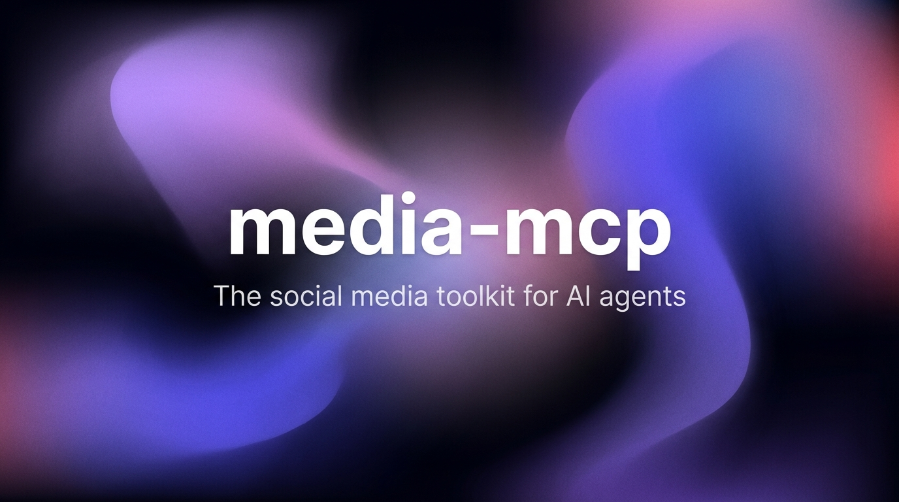

<p align="center">
  
</p>

# media-mcp

[](https://github.com/woosal1337/media-mcp/actions/workflows/ci.yml)
[](https://www.npmjs.com/package/media-mcp)
[](./LICENSE)

Social media at your fingertips. 31 tools across Twitter/X, YouTube, Instagram, and video processing — from Claude Desktop, Claude Code, or any MCP client. 100% open source.

Point it at a tweet and get the full text, metrics, and video transcription. Give it a YouTube URL and get the transcript. Drop an Instagram reel and get the media downloaded plus audio transcribed. All transcription runs locally via Whisper — no audio leaves your machine.

## The thesis: ears always, eyes only when the ears fail

Small Whisper models are great at hearing but terrible at reading. They mishear unusual names. They can't transcribe text on screen. They skip burned-in captions. For 90% of questions about a video this doesn't matter — the gist is enough.

But when a user asks *"what's the install command in this reel?"* or *"what's the handle he showed?"*, transcription alone will confidently give the wrong answer. The URL was on screen. The proper noun was spelled out in the caption. Whisper never saw any of it.

media-mcp transcribes with per-token confidence via `whisper-cli -ojf` and flags **uncertainty zones** (where Whisper admits it was guessing) and **demonstrative phrases** (`"visit our"`, `"this command"`, `"in the bio"` — strong signals that on-screen content is being referenced). The LLM reads those markers and decides whether to call `get_video_frames_at` on the specific timestamps that need visual verification. Frames only come out when they need to. The LLM's own vision does the reading — no OCR, no second model.

Result: the agent has ears on every video, eyes only where ears fail. Minimum frames, maximum accuracy.

## What it does

- **Fetches** tweets, threads, profiles, followers, trends, and search results from Twitter/X (26 tools via TwitterAPI.io REST API, with optional Xquik support for overlapping read tools)
- **Transcribes** video audio locally using whisper-cli — downloads media, extracts audio with ffmpeg, runs Whisper on your hardware, emits **per-token confidence** and **demonstrative-phrase hits** so the LLM knows where the audio channel is unreliable
- **Downloads** Instagram posts, reels, and carousels to local folders via a self-hosted Cobalt instance
- **Extracts** frames from any video URL at configurable FPS — or precisely at an array of timestamps via `get_video_frames_at` (cache-aware, no re-download on follow-ups)
- **Monitors** Twitter users in real-time and filters tweets by keyword rules
- **Caches** downloaded videos in `~/.media-mcp/cache/videos/` (sha256-of-URL keyed, 24h TTL) so transcription + frame-lookup on the same video happens in one download

## How it works

The LLM never scrapes HTML or parses DOM. Every tool calls a purpose-built API and returns structured, LLM-ready text.

**For text data** (tweets, profiles, trends): one REST call to TwitterAPI.io by default, parsed into formatted output. Set `TWITTER_BACKEND=xquik` with `XQUIK_API_KEY` to use Xquik for overlapping read tools.

**For transcription** (tweet videos, YouTube, Instagram reels): the pipeline downloads media to the shared cache, extracts audio with ffmpeg (16kHz mono WAV), transcribes with whisper-cli using `-ojf` (output-json-full) to preserve per-token probabilities, then returns a LLM-readable transcript with inline `⟨token p=0.XX⟩` markers plus summary blocks for uncertainty zones and demonstrative phrases. For YouTube, captions are tried first (instant) — Whisper is only the fallback.

**For visual data** (Instagram images, video frames): media is downloaded to a local folder and absolute file paths are returned so the LLM can read them directly with vision. Frame extraction has two modes: bulk (`extract_video_frames` at configurable FPS) and precision (`get_video_frames_at` — one JPG per timestamp, for targeted verification of transcription-uncertain moments).

## Pipeline

```
URL ──► Detect platform
             │
             ├── Twitter ──► TwitterAPI.io or Xquik REST ──► structured text
             │                     │
             │               has video? ──► cache ──► ffmpeg ──► whisper-cli -ojf
             │                                                         │
             │                                       transcript + confidence markers
             │
             ├── YouTube ──► try captions (instant)
             │                     │
             │               no captions? ──► yt-dlp ──► ffmpeg ──► whisper-cli -ojf
             │
             ├── Instagram ──► Cobalt API ──► download to cache
             │                     │
             │               has video? ──► ffmpeg ──► whisper-cli -ojf
             │
             ├── Video URL ──► cache ──► ffmpeg -vf fps=N ──► frame JPGs
             │
             └── Video URL + timestamps[] ──► cache ──► ffmpeg -ss each ──► one JPG per timestamp
                 (for targeted verification when transcription uncertainty demands it)
```

Transcription always includes per-token confidence and demonstrative-phrase scans. The LLM routes to frame extraction when those signals say it's needed.

All transcription is local. All temp files are cleaned up. Downloaded videos live in a shared cache (`~/.media-mcp/cache/videos/`) for 24h so follow-up calls on the same URL don't re-download. The LLM gets structured text or file paths — never raw API JSON.

## Design principles

1. **Structured data, not scraping.** Every tool calls a purpose-built API. No HTML parsing, no fragile selectors, no browser automation.
2. **Local transcription only.** Audio never leaves the machine. Whisper runs on local hardware.
3. **Captions first, Whisper second.** Don't burn compute when the platform already did the work.
4. **One tool, one job.** No multi-purpose tools with mode flags. Each tool does exactly one thing.
5. **File paths for visual content.** Return absolute paths so the LLM can see images directly.
6. **Ears always, eyes only when ears fail.** Transcription is cheap; vision tokens are expensive. The LLM sees frames only at timestamps where Whisper admits it was unsure, or where the speaker is explicitly referencing something on screen. Not at 1 fps. Not as keyframes. Exactly where accuracy actually needs it.
7. **No OCR layer.** Claude's vision reads the frames directly. One model doing all multimodal reasoning beats a two-model seam where OCR and vision compete.

See [`SKILL.md`](./SKILL.md) for the full pipeline details, tool reference, and anti-patterns.

## Get started

### npx (fastest)

```bash
TWITTER_API_KEY=your_key npx media-mcp
```

Or register it with Claude Code in one command:

```bash
claude mcp add media-mcp -e TWITTER_API_KEY=your_key -- npx media-mcp
```

The Whisper base model downloads automatically on first transcription into `~/.media-mcp/models/`. ffmpeg, whisper-cli, and yt-dlp still need to be installed (see Prerequisites).

### Docker

```bash
docker run -i --rm \
  -e TWITTER_API_KEY=your_key \
  -v media-mcp-data:/data \
  ghcr.io/woosal1337/media-mcp
```

The image bundles ffmpeg, yt-dlp, and whisper-cli. Models and the video cache persist in the `/data` volume.

### From source

```bash
git clone https://github.com/woosal1337/media-mcp.git
cd media-mcp
npm install && npm run build
```

Download the Whisper model (optional — skipped models are fetched on demand):

```bash
mkdir -p models
curl -L -o models/ggml-base.bin \
  https://huggingface.co/ggerganov/whisper.cpp/resolve/main/ggml-base.bin
```

Create `.env`:

```bash
cp .env.example .env
# Edit with your keys:
# TWITTER_API_KEY=your_twitterapi_io_key
# Optional Xquik backend for overlapping read tools:
# TWITTER_BACKEND=xquik
# XQUIK_API_KEY=your_xquik_key
# XQUIK_BASE_URL=https://xquik.com/api/v1
# WHISPER_MODEL_PATH=/absolute/path/to/models/ggml-base.bin
# COBALT_API_URL=http://localhost:9000       (optional, for Instagram)
# COBALT_API_KEY=your_cobalt_key             (optional)
# CLOUDFLARE_ACCOUNT_ID=your_account_id     (optional, for fetch_markdown)
# CLOUDFLARE_API_TOKEN=your_api_token       (optional, for fetch_markdown)
```

## Prerequisites

| Dependency | Required | What it does | Install |
|---|---|---|---|
| [Node.js](https://nodejs.org/) 20+ | Yes | Runs the MCP server | `brew install node` |
| [ffmpeg](https://ffmpeg.org/) | Yes | Audio extraction + frame extraction | `brew install ffmpeg` |
| [whisper-cli](https://github.com/ggerganov/whisper.cpp) | Yes | Local audio transcription | `brew install whisper-cpp` |
| [yt-dlp](https://github.com/yt-dlp/yt-dlp) | Yes | Video downloads from YouTube + others | `brew install yt-dlp` |
| [TwitterAPI.io](https://twitterapi.io/) key | Yes, unless using Xquik for read-only tools | Powers all Twitter/X tools | [twitterapi.io](https://twitterapi.io/) |
| [Xquik](https://xquik.com/) key | Optional | Powers overlapping read-only Twitter/X tools | [xquik.com](https://xquik.com/) |
| [Cobalt](https://github.com/imputnet/cobalt) instance | Optional | Instagram downloads | See [Cobalt setup](#cobalt-setup) |

## Configuration

### Claude Code

Add to `~/.claude/settings.json`:

```json
{
  "mcpServers": {
    "media-mcp": {
      "command": "node",
      "args": ["/absolute/path/to/media-mcp/dist/index.js"],
      "env": {
        "TWITTER_API_KEY": "your_key",
        "TWITTER_BACKEND": "twitterapi",
        "WHISPER_MODEL_PATH": "/absolute/path/to/media-mcp/models/ggml-base.bin",
        "COBALT_API_URL": "http://localhost:9000",
        "COBALT_API_KEY": "your_cobalt_key",
        "CLOUDFLARE_ACCOUNT_ID": "your_account_id",
        "CLOUDFLARE_API_TOKEN": "your_api_token"
      }
    }
  }
}
```

### Claude Desktop

Add to `~/Library/Application Support/Claude/claude_desktop_config.json` (macOS) or `%APPDATA%\Claude\claude_desktop_config.json` (Windows) — same structure as above.

### Environment variables

| Variable | Required | Description |
|---|---|---|
| `TWITTER_API_KEY` | Yes, unless `TWITTER_BACKEND=xquik` | API key from [twitterapi.io](https://twitterapi.io/) |
| `TWITTER_BACKEND` | No | `twitterapi` by default. Use `xquik` for overlapping read tools. |
| `XQUIK_API_KEY` | Required when `TWITTER_BACKEND=xquik` | API key from [Xquik](https://xquik.com/) |
| `XQUIK_BASE_URL` | No | Xquik API base URL, defaults to `https://xquik.com/api/v1` |
| `WHISPER_MODEL_PATH` | No | Path to a Whisper model. When unset and no local model exists, the base model is downloaded automatically on first use |
| `MEDIA_MCP_MODEL_DIR` | No | Where auto-downloaded Whisper models live (defaults to `~/.media-mcp/models`) |
| `MEDIA_MCP_CACHE_DIR` | No | Where the 24h video cache lives (defaults to `~/.media-mcp/cache`) |
| `COBALT_API_URL` | No | URL of your Cobalt instance (required for Instagram) |
| `COBALT_API_KEY` | No | Cobalt API key if auth is enabled |
| `CLOUDFLARE_ACCOUNT_ID` | No | Cloudflare account ID (required for `fetch_markdown`) |
| `CLOUDFLARE_API_TOKEN` | No | Cloudflare API token with Browser Rendering permission (required for `fetch_markdown`) |

## Tools

### Twitter/X — 26 tools

TwitterAPI.io remains the default backend for all Twitter/X tools. `TWITTER_BACKEND=xquik` supports the overlapping read tools for tweets, profiles, timelines, followers, following, mentions, search, retweeters, follow checks, and trends. Tools for Spaces, lists, communities, bookmarks, monitors, and filter rules still require `TWITTER_API_KEY`.

#### Fetching tweets

| Tool | Action | What it does |
|---|---|---|
| `get_tweet` | **Fetch + Transcribe** | Fetches tweet by URL with text, author, metrics, media, threads, articles. Transcribes video audio via Whisper (optional `language` and `model` params). |
| `get_user_tweets` | **Fetch** | Recent tweets from a user (paginated, 20/page) |
| `search_tweets` | **Search** | Advanced search with operators (`from:`, `to:`, `#hashtag`, `min_faves:`, date ranges) |
| `get_tweet_replies` | **Fetch** | Replies to a tweet (paginated, 20/page) |
| `get_tweet_replies_v2` | **Fetch + Sort** | Replies with sorting: Relevance, Latest, or Likes |
| `get_tweet_quotes` | **Fetch** | Quote tweets of a tweet (paginated, 20/page) |
| `get_tweet_retweeters` | **Fetch** | Users who retweeted a tweet (paginated, 100/page) |
| `get_list_timeline` | **Fetch** | Tweets from a Twitter list |
| `get_community_tweets` | **Fetch** | Tweets from a Twitter community |
| `get_trends` | **Fetch** | Trending topics (worldwide or by WOEID location) |

#### Fetching profiles

| Tool | Action | What it does |
|---|---|---|
| `get_user_profile` | **Fetch** | User bio, follower counts, verification, location, website |
| `get_user_about` | **Fetch** | Extended profile info beyond the basic profile |
| `get_user_followers` | **Fetch** | Followers of a user (paginated, 200/page) |
| `get_user_following` | **Fetch** | Accounts a user follows (paginated, 200/page) |
| `get_user_mentions` | **Fetch** | Tweets mentioning a user (paginated, 20/page) |
| `get_verified_followers` | **Fetch** | Verified (blue check) followers (paginated, 20/page) |
| `search_users` | **Search** | Search users by keyword |
| `check_follow_relationship` | **Check** | Whether user A follows user B and vice versa |
| `get_space_detail` | **Fetch** | Twitter Space metadata (title, host, speakers, state) |

#### Real-time monitoring

| Tool | Action | What it does |
|---|---|---|
| `monitor_user_add` | **Start** | Begin real-time monitoring of a user's tweets |
| `monitor_user_list` | **List** | All currently monitored users |
| `monitor_user_remove` | **Stop** | Stop monitoring a user |
| `filter_rule_add` | **Create** | Add a keyword filter rule for monitoring |
| `filter_rule_list` | **List** | All active filter rules |
| `filter_rule_delete` | **Delete** | Remove a filter rule |

### YouTube — 1 tool

| Tool | Action | What it does |
|---|---|---|
| `get_youtube_transcript` | **Fetch + Transcribe** | Gets video transcript. Tries captions first (instant, in the requested `language` when set). Falls back to yt-dlp + ffmpeg + Whisper if no captions. Optional `language` and `model` params. |

### Instagram — 1 tool

| Tool | Action | What it does |
|---|---|---|
| `get_instagram_post` | **Download + Transcribe** | Downloads all media (images, videos, carousels) to local folder via Cobalt. Transcribes video audio with Whisper (optional `language` and `model` params). Returns local file paths. |

### Cloudflare — 1 tool

| Tool | Action | What it does |
|---|---|---|
| `fetch_markdown` | **Extract** | Extracts clean markdown from any webpage using Cloudflare Browser Run. Works on JS-heavy pages, SPAs, and sites where simple fetch fails. |

### Video — 2 tools

| Tool | Action | What it does |
|---|---|---|
| `extract_video_frames` | **Download + Extract** | Downloads video from any URL, extracts frames at configurable FPS via ffmpeg. Supports time ranges. Returns local frame paths. Cache-aware. |
| `get_video_frames_at` | **Precision Extract** | Grabs one JPG per specified timestamp. Pairs with the transcription tools — when the transcript flags uncertainty zones or demonstrative phrases, pass their `midpoint_s` values here and the LLM reads the JPGs with its own vision. Cache-aware (no re-download on follow-ups). |

## How transcription works

```
video → cache → ffmpeg -ar 16000 -ac 1 → audio.wav → whisper-cli -ojf → audio.wav.json
                                                                            │
                                                                            ▼
                                                         parse per-token probabilities
                                                                            │
                                                                            ▼
                                        transcript with ⟨token p=0.XX⟩ markers
                                        + Uncertainty zones summary (midpoint_s each)
                                        + Demonstrative phrases block (midpoint_s each)
```

1. Video is downloaded to `~/.media-mcp/cache/videos/<sha256>.mp4` (reused if present, <24h old)
2. ffmpeg extracts audio as 16kHz mono WAV
3. whisper-cli transcribes locally with `-ojf` (output-json-full) — JSON includes per-token `p` values
4. Tokens below p=0.5 are merged into contiguous spans (≤150ms gap) and reported as uncertainty zones
5. The segment text is scanned for demonstrative phrases that typically reference on-screen content
6. The LLM receives segment-level transcript + uncertainty zones + demonstrative hits, and decides whether to call `get_video_frames_at` with the relevant timestamps

For YouTube, captions are tried first (instant, already timestamped). Whisper is the fallback. All transcription happens locally — no audio is sent to external services.

## Cobalt setup

[Cobalt](https://github.com/imputnet/cobalt) is an open-source media downloader supporting 21 platforms. media-mcp uses it for Instagram. You need your own instance — the public API requires JWT auth that doesn't work server-to-server.

### Docker (recommended)

```yaml
# docker-compose.yml
services:
  cobalt:
    image: ghcr.io/imputnet/cobalt:11
    init: true
    read_only: true
    restart: unless-stopped
    ports:
      - 9000:9000/tcp
    environment:
      API_URL: "http://localhost:9000/"
    labels:
      - com.centurylinklabs.watchtower.scope=cobalt

  watchtower:
    image: ghcr.io/containrrr/watchtower
    restart: unless-stopped
    command: --cleanup --scope cobalt --interval 900 --include-restarting
    volumes:
      - /var/run/docker.sock:/var/run/docker.sock
```

```bash
docker compose up -d
curl http://localhost:9000/   # verify
```

### Adding API key auth

```bash
node -e "console.log(crypto.randomUUID())"   # generate key
```

Create `keys.json`:

```json
{
  "your-uuid": {
    "name": "media-mcp",
    "limit": "unlimited",
    "allowedServices": "all"
  }
}
```

Add to cobalt environment:

```yaml
environment:
  API_KEY_URL: "file:///keys.json"
  API_AUTH_REQUIRED: 1
volumes:
  - ./keys.json:/keys.json:ro
```

### Adding cookies (for private content)

Create `cookies.json` with your Instagram `sessionid`, mount as `/cookies.json`, and set `COOKIE_PATH: "/cookies.json"` in environment.

### Production hardening

```yaml
environment:
  CORS_WILDCARD: 0
  CORS_URL: "http://localhost"
  RATELIMIT_WINDOW: 60
  RATELIMIT_MAX: 100
  DURATION_LIMIT: 10800
```

### Supported platforms

Cobalt supports 21 platforms. Currently media-mcp uses it for Instagram. Future versions will add more: YouTube, TikTok, Twitter/X, Reddit, Facebook, Pinterest, Snapchat, Bluesky, Twitch, Vimeo, SoundCloud, Dailymotion, Tumblr, Bilibili, Loom, Streamable, Rutube, Newgrounds, OK.ru, VK.

## One-command setup

Copy the contents of [PROMPT.md](./PROMPT.md) and paste it into Claude Code. It will install all prerequisites, clone the repo, configure everything, and connect media-mcp automatically.

## Transcription language and model

All three transcription tools accept two optional parameters:

- **`language`** — ISO 639-1 code (`en`, `es`, `tr`, `de`, ...) or `auto` for autodetection. Defaults to English. On YouTube, captions are requested in this language before Whisper runs.
- **`model`** — `tiny`, `tiny.en`, `base`, `base.en`, `small`, `small.en`, `medium`, `medium.en`, `large-v3`, or `large-v3-turbo`. Known names are downloaded once from HuggingFace into `~/.media-mcp/models/` and reused. An absolute path to any ggml `.bin` file also works. Bigger models are slower and more accurate — `large-v3-turbo` is the sweet spot when base mishears too much.

## Development

```bash
npm run dev        # watch mode (recompiles on change)
npm run build      # one-time build
npm test           # run the unit test suite
npm run test:watch # tests in watch mode
npm start          # run the server
```

CI runs build + tests on Node 20 and 22 for every push and PR. Releases are tag-triggered: pushing `v*` publishes to npm with provenance, creates a GitHub Release, and pushes the Docker image to GHCR.

## License

MIT
